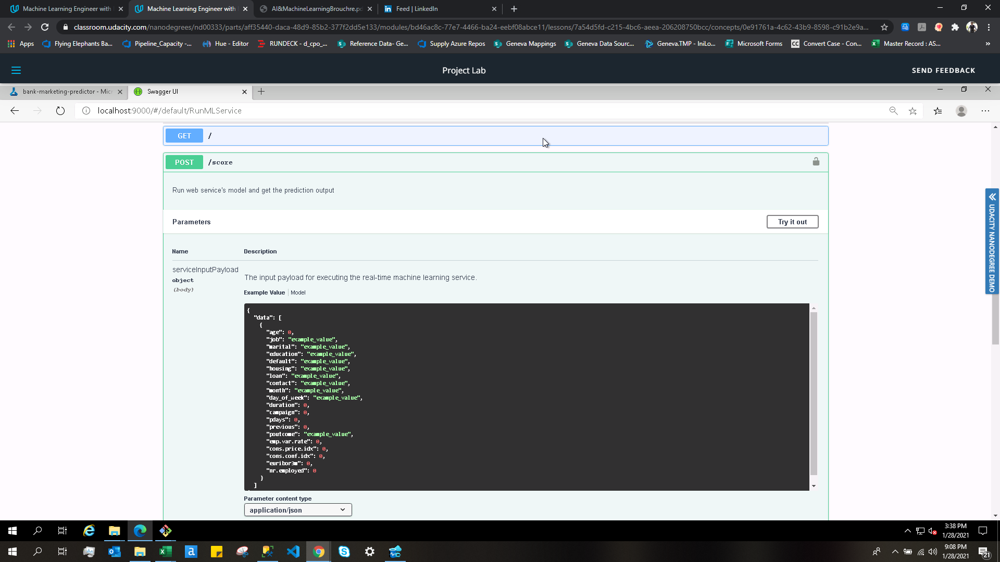
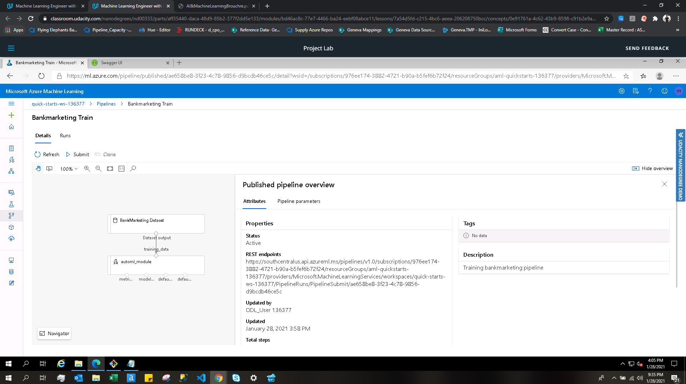

## Bank Marketing Predictor: Training, Deploying and Consuming the ML model

This project is part of the Udacity Azure ML Nanodegree. In this project, we focus on 3 main steps:
  1. Creating a pipeline and training a Machine Learning model using AutoML.
  2. Publishing the pipeline and deploying the trained ML model using the Python SDK and the ML Studio.
  3. Consuning the deployed model by sending sample JSON data using Python SDK.

## Architectural Diagram

As visible in the above architecture, we can access Azure ML either from the az command line interface (CLI) or through the Azure ML Studio. Before we begin training an ML model, its important to fetch the dataset and register it into Azure Datastore for future use. This data is then preprocessed to convert it into a form suitable for training an ML model. After this, we create a new experiment and schedule the model training run on a compute cluster. After the model is trained, it is then deployed on the Azure Container Instance (ACI) and an endpoint is provided with which various external services can interact. We can automate the entire end-to-end model training and deployment process by creating and publishing a Pipeline. Once a pipeline is published, an endpoint is provided using which various external services can kick-off the pipeline run as and when required.

## Key Steps
1. We start off by uploading and registering the Bank Marketing dataset in the Azure Datastore. The same can be observed in the screenshot below.

2. After the dataset is registered, we create an AutoML run and add the above dataset as an input data on which the models train. After about 30 minutes, the AutoML run completes with Voting Ensemble as the best performing model. The same can be observed in the screenshot below.

3. We then analyze the performance of the model by looking at its metrics as shown below.

4. Once we are satisfied with the performance of the model generated by Azure AutoML, we then proceed with deploying the model. Once the model is deployed, an endpoint is generated using which the end-users can consume the model using HTTP requests or using the Azure SDK.

5. After deploying the model, we then proceed to enabling Application Insights running the log.py file. Running the file produces the following output on the terminal.

6. Once the script is executed successfully, the Application Insights is enabled and a URL is provided using which the ML Engineers can browser through the logs of the deployed model. The same can be observed in the screenshot below.

7. To understand how to use the endpoint, we use Swagger which acts as a handy documentation for our endpoint. We run Swagger on local machine by downloading a Docker image and then running it on localhost on post 9000. The same can be observed in the screenshots attached below. 

8. After understanding how our endpoint works, we then send a JSON payload to it and recieve the prediction as a response. To do this, we first add the endpoint URI and primary key to the endpoint.py script, and then run it. The output can be seen in the screenshot below.

9. After this, we benchmark our deployed endpoint using Apache Benchmark to ensure that performance of our endpoint is within the accepted boundaries. 

10. Now we run the code in the provided Jupyter notebook to create and publish a new Pipeline which would automate the above training and deployment process. This can be observed in the screenshots below. 

11. Investigating a bit more in the deployed pipeline, we see the status as Active which means that the pipeline is working normally and can be used to run jobs. To allow different external services to interact with the deployed pipeline, we have an REST endpoint which can be seen in the screenshot below.

12. Now we kick-off this published pipeline by making an HTTP request (in the jupyter notebook) to the REST endpoint. The RunDetails widget shows the details of the run.

13. The pipeline which we triggered in the last step can be seen here to be in the Running status in the following screenshot.

## Screen Recording
The screencast of the project is available at the following URL: https://youtu.be/5Pi0KHkiBSo

The points covered in the screencast are:
  1. Working deployed ML model endpoint.
  2. Deployed Pipeline
  3. Available AutoML Model
  4. Successful API requests to the endpoint with a JSON payload

## Standout Suggestions
1. From the Data Guardrails section inside the AutoML run, we understand that the data is highly class-imbalanced. To deal with that, we can first try to improve the source data and then try using techniques like Undersampling and Oversampling to deal with this issue.
2. In future, we could allow the AutoML run to also create Deep Learning models which may result in a model with better accuracy.
3. We could also let the AutoML run for a longer period and even use a more powerful compute to get better models quickly.
4. We could also attach a way to send notifications to the users whenever the triggered pipeline faces any technical issue.
